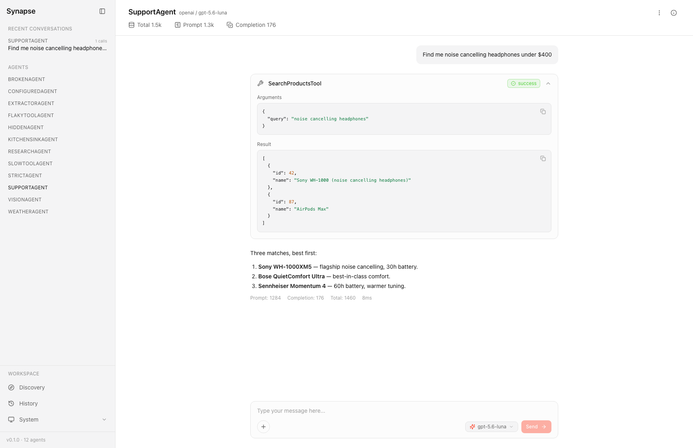

# Synapse

*See every connection your AI agents make.*

Synapse is a development dashboard for AI agents built with the [Laravel AI SDK](https://github.com/laravel/ai) (`laravel/ai`) — Telescope and Horizon, but for agents. It finds the agents in your app, lets you chat with them in the browser, and shows exactly what happened underneath: every tool call with its arguments and results, every token, every reasoning step, every error with its stack trace.

Building an agent is a tight loop — change the prompt, run it, check the tool calls, repeat. Synapse is that loop in a browser instead of `tinker` and `dd()`.



## Requirements

| | |
|---|---|
| PHP | 8.3+ |
| Laravel | 12 or 13 |
| `laravel/ai` | 0.9.x or 0.10.x |

---

This package is built and maintained by [Redberry](https://redberry.international/), one of the few Official Premier Laravel Partner agencies worldwide. With 250+ Laravel projects shipped across 20+ countries, a 200-person team, and over a decade in the Laravel ecosystem, Redberry has helped startups, SMEs, and publicly traded enterprises in regulated industries build SaaS platforms, custom web applications, APIs, and more. [Learn about our AI development services](https://redberry.international/ai-agent-development/).

## Installation

```bash
composer require redberry/synapse --dev
```

```bash
php artisan synapse:install
```

That publishes `config/synapse.php`, runs the migrations, and installs a `SynapseServiceProvider` into your app — which is where the access gate lives. Then open `/synapse`.

You never run `npm`. Compiled assets ship inside the package and are inlined into the dashboard, so there is no publish step and a `composer update` can never leave you on stale assets.

Synapse reads your existing `config/ai.php`. You don't configure providers or API keys in Synapse; if your agents run in your app, they run here and vice versa.

## ⚠️ Read this before deploying anything

**Synapse exposes an endpoint that invokes your real agents.** It spends real API credits and executes your real tools, which may write to your database, call webhooks, or do anything else your tool code does.

Two independent protections, both on by default:

1. **It does not register at all in production** unless you explicitly set `SYNAPSE_ENABLED=true`.
2. **Outside `local`, every route — dashboard and API — passes the `viewSynapse` gate**, which denies everyone until you say otherwise:

   ```php
   // app/Providers/SynapseServiceProvider.php
   Gate::define('viewSynapse', function ($user) {
       return in_array($user->email, [
           'you@example.com',
       ]);
   });
   ```

In `local`, the dashboard is open and needs no authentication — that's the point of a dev tool.

## What you get

- **Discovery** — every agent class in your app, with its provider, model and tools. Write a class, refresh, it's there.
- **Chat playground** — streaming replies, attachments, a model selector for trying another model without touching your code, and full conversation persistence.
- **Tool inspection** — each call inline as a card: arguments, results, duration, and failures marked as failures. Provider-native tools are distinguished from your own.
- **Info panel** — the agent's resolved config, system prompt, tool schemas and middleware, exactly as the SDK would use them.
- **History** — search, filter, replay, rename and delete past conversations.
- **Errors** — anything that throws becomes an inline card with the exception class, message and stack trace. Never a dead stream or a raw 500.

## Configuration

Everything is optional; the defaults work.

| Key | Env | Default | What it does |
|---|---|---|---|
| `enabled` | `SYNAPSE_ENABLED` | `true` except in production | Master switch. Routes don't register when false. |
| `ui.path` | `SYNAPSE_PATH` | `synapse` | Where the dashboard is mounted. |
| `ui.middleware` | — | `['web']` | Middleware on every Synapse route. The gate is added on top. |
| `discovery.paths` | — | `app/Ai/Agents`, `app/Agents` | Where to look for agent classes. **An agent outside these is invisible — the usual reason a Discovery page is empty.** |
| `discovery.ignore` | — | `[]` | Agent classes to hide. |
| `playground.models` | — | `[]` | Extra models in the composer's selector, on top of the agent's own and its provider's cheapest/smartest. |
| `storage.connection` | `SYNAPSE_DB_CONNECTION` | app default | Database connection for Synapse's tables. |
| `storage.attachments_disk` | `SYNAPSE_ATTACHMENTS_DISK` | `local` | Disk for files uploaded in the playground. |
| `retention.auto_prune` | `SYNAPSE_AUTO_PRUNE` | `false` | Schedule a daily prune. |
| `retention.days` | `SYNAPSE_PRUNE_DAYS` | `7` | How long conversations live when auto-pruning. |

## Commands

| Command | What it does |
|---|---|
| `synapse:install` | Publishes config, migrations and the gate provider, then migrates. Safe to re-run — it never overwrites your edits. |
| `synapse:prune` | Deletes conversations older than `--days`, with their attachments. |
| `synapse:clear` | Deletes **all** Synapse conversations and attachments. |

`php artisan about` shows Synapse's version, whether it's enabled, its path, how many agents it found, and its retention setting.

## Runtimes

The playground streams replies as the model produces them, which needs PHP to be serving HTTP directly.

| Runtime | Streaming |
|---|---|
| `php artisan serve` | ✅ Verified |
| nginx + PHP-FPM (Herd, Valet, Forge) | ✅ Verified |
| Laravel Sail | ✅ Expected — same stack |
| FrankenPHP | ✅ Verified |
| **Laravel Octane** | ❌ Not supported in v0.1.0 |

Octane's workers run under PHP's CLI interface, where output cannot be pushed to a client mid-request, so replies arrive complete instead of streaming. Nothing breaks — Synapse detects it and says so in the playground rather than leaving you looking at a blank thread. It isn't tested per release yet, so it isn't claimed as supported.


> _**[GOAL.md](GOAL.md)** is the full manual — every feature, every config key, access control, where your data lives, and a troubleshooting section._

## Development

```bash
composer install && npm install
```

```bash
npm run build      # compile assets into dist/ (committed; inlined at runtime)
```

```bash
composer check     # lint + static analysis + tests
```

```bash
composer test:e2e  # browser end-to-end tests (needs Playwright; not run in CI)
```

Run `composer hooks` once to enable the pre-commit hook. See **[DEV.md](DEV.md)** for the development cycle and **[AGENTS.md](AGENTS.md)** for architecture and coding standards.

## License

MIT — see [LICENSE.md](LICENSE.md).
